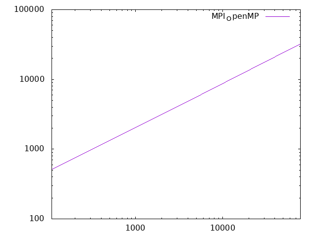
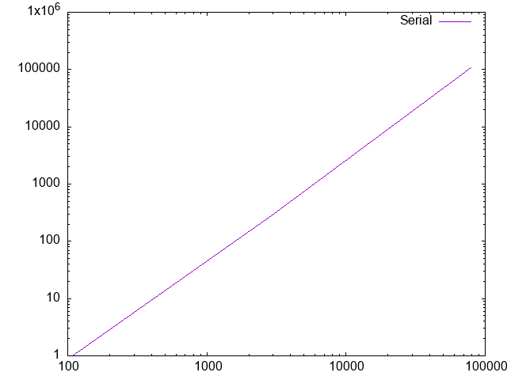
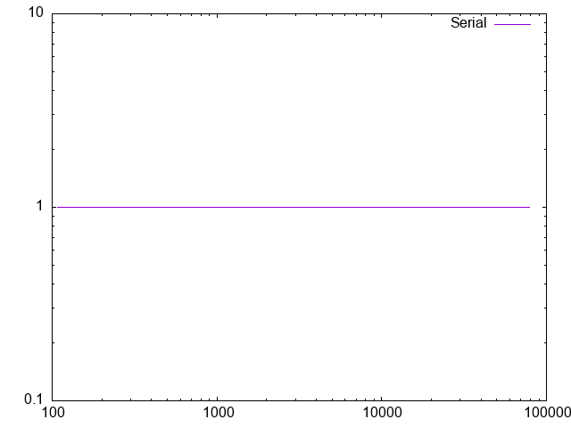
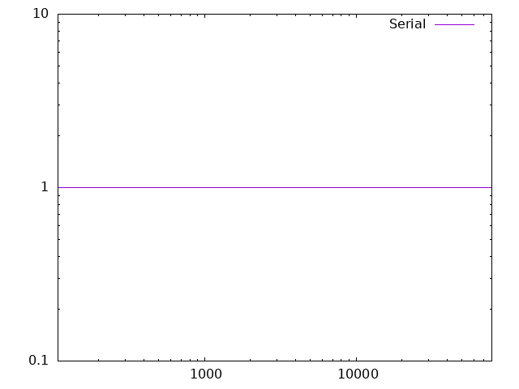
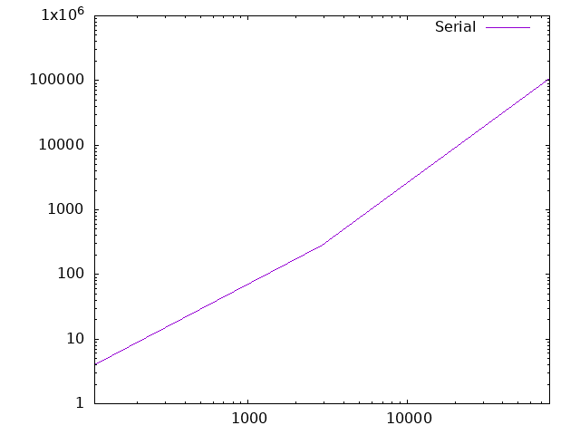

# LJMB
A simple Lennard-Jones Many-Body (LJMB) Simulator Optimization and Parallelization

- Andrea -> openmp
- Fathi  -> mpi
- Ken    -> optimization

## Functions
Splitted functions source files are in LJMD/src:
- main.cpp: main function
- init.c: initialize -> reading input files and restart, memory allocation
- comp.c: ekin -> kinetic energy computation; force -> forces computation
- verlet.c: velverlet -> velocity propagation by half, position by a full step; velverlet_prop -> propagate velocities by another half step 
- utils.c: azzero -> array gets all elements zeroed; helper -> apply minimum image convention; get_a_line: reads a line from a file and cuts away blank spaces and comments
- output.c: output -> append data to output file
- cleanup.c: cleanup -> close files, free allocated memory.

## Headers and auxiliary files
Headers and auxiliary files are in LJMD/inc:
- structs.c: physical constants which are used during computation
- Timer.hpp: functions for measuring and printing time results
- myMPI.hpp: MPI variables
- init.h, comp.h, verlet.h, utils.h, output.h, cleanup.h: prototypes for the respective functions.
The headers and auxiliary files are built by the compiler into a mdlib library.

## Implemented tests
The implemented test framework for the separated functions is GoogleTest. The src files used for compiling are in LJMB/test. After compiling, the tests executables can be found in LJMB/build. All tests are executed on 2 particles:
- test_comp -> testing ekin, force functions
- test_utils -> testing azzero, pbc functions 
- test_verlet -> testing velverlet, velverlet_prop functions

## Comparison

