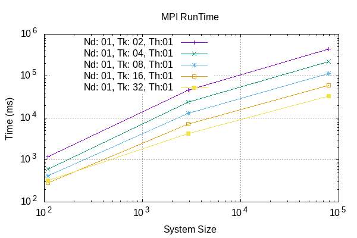
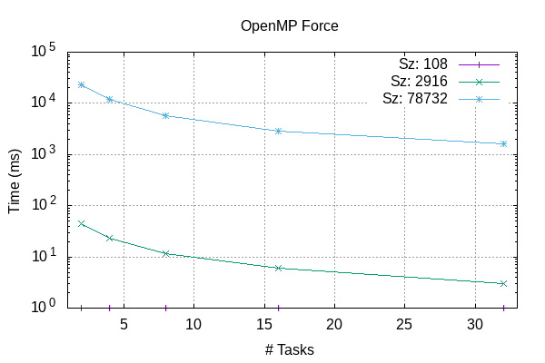
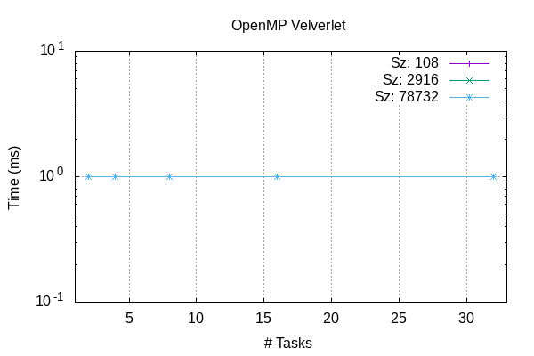

# LJMB
A simple Lennard-Jones Many-Body (LJMB) Simulator Optimization and Parallelization

- Andrea -> openmp
- Fathi  -> mpi
- Ken    -> optimization

## Running
Compile with cmake -S . -B build -D LJMD_MPI=ON -D LJMD_OPENMP=ON; for compiler optimization flags, add -DCMAKE_CXX_FLAGS="-O3 -Wall -ffast-math -fexpensive-optimizations -msse3".
From command line, while in LJMB/data folder:
1) export export OMP_NUM_THREADS=<n. threads>
2) mpirun --bind-to-socket -np <n. processing elements> ../build/MAIN.x < <chosen .inp file> 
Input .inp and .rest files, output .dat and .xyz files can be found in LJMB/data; simulation outputs can be compared with references in LJMB/data/refs folder. Input files contain the physical parameters to start the simulation for 108, 2916 and 78732 atoms of argon in liquid state.  

## Functions
Splitted functions source files are in LJMD/src:
- main.cpp: main function
- init.c: initialize -> reading input files and restart, memory allocation
- comp.c: ekin -> kinetic energy computation; force -> forces computation
- verlet.c: velverlet -> velocity propagation by half, position by a full step; velverlet_prop -> propagate velocities by another half step 
- utils.c: azzero -> array gets all elements zeroed; helper -> apply minimum image convention; get_a_line: reads a line from a file and cuts away blank spaces and comments
- output.c: output -> append data to output file
- cleanup.c: cleanup -> close files, free allocated memory.

## Headers and auxiliary files
Headers and auxiliary files are in LJMD/inc:
- structs.c: physical constants which are used during computation
- Timer.hpp: functions for measuring and printing time results
- myMPI.hpp: MPI variables
- init.h, comp.h, verlet.h, utils.h, output.h, cleanup.h: prototypes for the respective functions.
The headers and auxiliary files are built by the compiler into a mdlib library.

## Implemented tests
The implemented test framework for the separated functions is GoogleTest. The src files used for compiling are in LJMB/test. After compiling, the tests executables can be found in LJMB/build. All tests are executed on 2 particles:
- test_comp -> testing ekin, force functions
- test_utils -> testing azzero, pbc functions 
- test_verlet -> testing velverlet, velverlet_prop functions

## Benchmarks
We performed a series of benchmarks on the Leonardo HPC supercomputer hosted by CINECA, using the Booster partition with 32 cores per node. 
These benchmarks consider the timings and number of calls, depending on the simulation sizes (108, 2916, 78732 atoms) for the Force, Velverlet, Propagate, Kinetic Energy computation functions, as well as the total Run Time, under several configurations of number of processing elements (cores), number of threads, and number of nodes. 

### Serial
Serial runs without optimizations.

### Optimized
Serial runs with "-O3 -Wall -ffast-math -fexpensive-optimizations -msse3" compiler flags and code optimizations: specifically,the application of Newton's 3rd law for Forces computation (in comp.c function) and avoiding time expensive math functions like pow(), sqrt(), division. 
However, these optimizations determine a known floating point divergence between the simulation results and the reference datasets, which is especially evident using 108 atoms for the simulation size.  

The optimizations, as expected, mostly determine speedups in the execution of the Force computation time:

### MPI
Parallel runs by Message Passing with:
- Number of nodes: 1;
- Number of processing elements: 2, 4, 8, 16, 32;
- Number of threads: 1.
The MPI code parts are activated by "ifdef MY_MPI

### OpenMP
Parallel runs with:
- Number of nodes: 1;
- Number of processing elements: 1;
- Number of threads: 2, 4, 6, 8, 16, 32.

### MPI+OpenMP
Parallel runs with: 
- Number of nodes: 1;
- Number of processing elements: 2, 4, 6, 8, 16, 32;
- Number of threads: 2, 4, 6, 8, 16, 32.
Number of proc. elements*threads < 32 (maximum number of cores in a Leonardo node in Booster).

