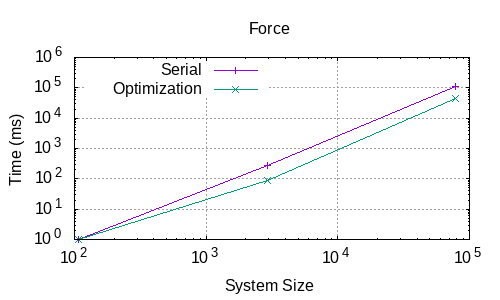
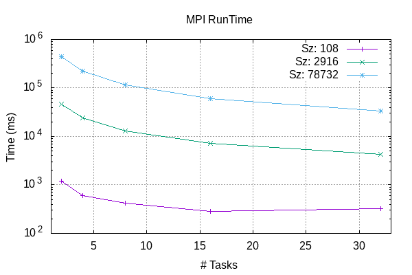
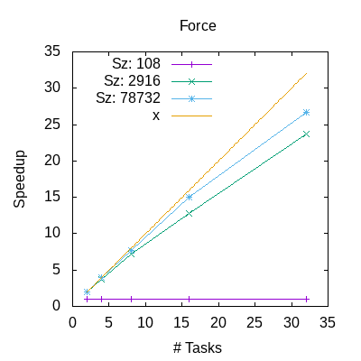
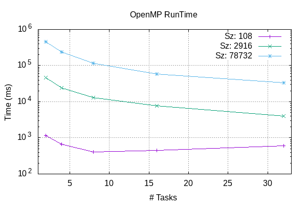
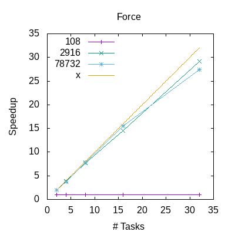
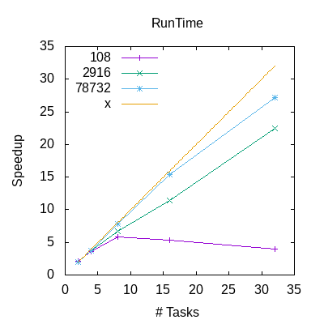

# LJMB
A simple Lennard-Jones Many-Body (LJMB) Simulator Optimization and Parallelization

- Andrea -> PpenMP
- Fathi  -> MPI
- Ken    -> Optimization

## Filesystem

    LJMB/
    ├── CMakeLists.txt
    ├── data/
    │   ├── argon_108.inp
    │   ├── argon_2916.inp
    │   ├── argon_78732.inp
    │   └── ...
    ├── doc/
    │   └── Assignment.pdf
    ├── img/
    │   └── ...
    ├── inc/
    │   └── ..
    ├── Makefile
    ├── README.md
    ├── src/
    │   ├── .old/
    │   │   └── ljmd.c
    │   └── ...
    └── test/
        ├── test_comp.cpp
        ├── test_utils.cpp
        └── test_verlet.cpp

## Running
In order to compile in LJMB folder, we use the following CMake command:

```$ cmake -S . -B build -DLJMD_MPI=ON -DLJMD_OPENMP=ON```

For compiler optimization flags, add:

```-DCMAKE_CXX_FLAGS="-O3 -Wall -ffast-math -fexpensive-optimizations -msse3"```

As the executable expects to recieve *input* information from the command line and search for other files such as *rest*, it is imperative to navigate to the *data* folder.

We specify the number of Open Multi-Processing (OpenMP) elements with the following command.

```$ export OMP_NUM_THREADS=<threads>```

It is highly suggested to know the number of threads the machine can handle to avoid any Hyperthreading activity which might cause the executable to run much slower than serial.

We run the executable by specify the number of Message Passing Interface (MPI) elements with the following command.

```$ mpirun --bind-to-socket -np <nPEs> ../build/MAIN.x < <input_file.inp>```

Simulation outputs can be compared with references in LJMB/data/refs folder. Input files contain the physical parameters to start the simulation for 108, 2916 and 78732 atoms of argon in liquid state.  

## Functions
Splitted functions source files are in LJMD/src:
- *main.cpp*: main function
- *init.c*: initialize -> reading input files and restart, memory allocation
- *comp.c*: ekin -> kinetic energy computation; force -> forces computation
- *verlet.c*: velverlet -> velocity propagation by half, position by a full step; velverlet_prop -> propagate velocities by another half step 
- *utils.c*: azzero -> array gets all elements zeroed; helper -> apply minimum image convention; get_a_line: reads a line from a file and cuts away blank spaces and comments
- *output.c*: output -> append data to output file
- *cleanup.c*: cleanup -> close files, free allocated memory.

## Headers and auxiliary files
Headers and auxiliary files are in LJMD/inc:
- *structs.c*: physical constants which are used during computation
- *Timer.hpp*: functions for measuring and printing time results
- *myMPI.hpp*: MPI variables
- *init.h, comp.h, verlet.h, utils.h, output.h, cleanup.h*: prototypes for the respective functions.
The headers and auxiliary files are built by the compiler into a mdlib library.

## Implemented tests
The implemented test framework for the separated functions is GoogleTest. The src files used for compiling are in LJMB/test. After compiling, the tests executables can be found in LJMB/build. All tests are executed on 2 particles:
- *test_comp* -> testing ekin, force functions
- *test_utils* -> testing azzero, pbc functions 
- *test_verlet* -> testing velverlet, velverlet_prop functions

## Benchmarks
We performed a series of benchmarks on the Leonardo HPC supercomputer hosted by CINECA, using the Booster partition with 32 cores per node. 
These benchmarks consider the timings and number of calls, depending on the simulation sizes (108, 2916, 78732 atoms) for the Force, Velverlet, Propagate, Kinetic Energy computation functions, as well as the total Run Time, under several configurations of number of processing elements (cores), number of threads, and number of nodes. The following plots show the timings for each call specifically of the Force function and RunTime.

### Serial vs. Optimized
The Force function timing and total RunTime of the serial version are here compared against runs with an Optimized version of the program. The latter uses *"-O3 -Wall -ffast-math -fexpensive-optimizations -msse3"* compiler flags and code optimizations, in particular the application of Newton's 3rd law for Forces computation (in comp.c function) and avoiding time expensive math functions like pow(), sqrt(), division. 
However, these optimizations determine a known floating point divergence between the simulation results and the reference datasets, which is especially evident using 108 atoms for the simulation.  




The optimizations, as expected, determine speedups in the execution of the Force computation time.
The *gprof* profiler of the Optimized version clearly shows that the majority of timing is due to the Force function (63.9 %):

 **Call graph**


*index|% time|self|children|name*

1|63.9|1.22|0.00|force

2|30.4|0.58|0.00|pbc 

3|5.2|0.10|0.00|azzero 

which explains why is it important to improve the speedup by parallelization of the Force function itself, as explained in the following paragraphs.

### MPI
Parallel runs by Message Passing Interface implementation with:
- Number of nodes: 1;
- Number of processing elements: 2, 4, 8, 16, 32;
- Number of threads: 1.
The MPI code parts are activated by *#ifdef MY_MPI [...] #endif*, set by -D LJMB_MPI=ON at compiling. Mpirank = 0 and number of processing elements are stored as default members of the *sys struct in case of -np = 1 or overwritten by each processor when np>1. MPI is mostly employed here to speed up the Force computation, by splitting it among different arrays of atoms managed by different processing units. This is generally made possible in Force function by: 
- broadcasting the position of atoms among processes
- creating indices employed by loop control flows dependent on the number of processes and their ranks,
- using dedicated buffers for the storage of computed forces 
- and finally reducing the forces computed by all processes and the total energy potential back into rank 0 process. This is done on top of the already implemented Optimized code.


The Force and RunTime timings by size show increments depending on the simulation size, as expected. 




The timings by increasing number of processing elements or tasks (nPEs) are decreasing with the increase in the number of nPEs; besides, the times increase with the size of the simulation. However, the smallest simulation (108) has practically constant timings while increasing the number of tasks.



The speedup over serial timings plots show a strong scalability for the largest simulation size (78732), while the smallest one soon reaches a plateau with weak scalability.   

### OpenMP
Parallel runs with Open MultiProcessing implementation with:
- Number of nodes: 1;
- Number of processing elements: 1;
- Number of threads: 2, 4, 8, 16, 32.
The OpenMP codelines, similarly to MPI, are enabled by *#ifdef (_OPENMP) [...] #endif* when -D LJMB_OPENMP=ON at compiling. Similarly to MPI, in the Force function OpenMP divides the force computation among different threads, actually following an MPI-like hybrid approach:
- creation of a parallel region, with reduction for the sum of all energy potentials;  
- each thread uses its own buffer pointers to hold full array of atoms, selected depending on the thread id, thus eliminating any race condition 
- after the computation of forces by each thread, an *omp barrier* is raised to synchronize the results of forces computed from all threads and reduce them in a parallel way, dependent on the number of threads. This is still done on top of the Optimized version of the Force function.
OpenMP *parallel for* is also applied to the loops inside the functions velverlet and velverlet_prop.  


The timings depending on simulation sizes for OpenMP show a similar trend to the ones produced under MPI, generally because of the MPI-like approach chosen for OpenMP threads. However, the type of reduction is different under the two approaches.




The time scalability with threads for Force and RunTime is also similar to the one from MPI: the size 108 is however showing slowdowns in RunTime with large number of threads, which are signs of weak scalability.  




The speedup under OpenMP is approaching the ideal speedup only in case of large sizes (2916, 78732), while the simulation with 108 atoms is generally not improving over the serial timings.

### MPI+OpenMP
Parallel runs using both MPI and OpenMP with: 
- Number of nodes: 1;
- Number of processing elements: 2, 4, 8, 16, 32;
- Number of threads: 2, 4, 8, 16, 32.
Number of proc. elements*threads < 32 (maximum number of cores in a Leonardo node in Booster).
This hybrid approach is done in an "orthogonal" way, where the MPI and OpenMP cohexist by using buffers with increased sizes, indices depending on nPEs and number of threads, as well as on the processor rank and thread id, and making sure that the MPI calls are not done inside the OpenMP parallel region.
We used heatmaps, one for each simulation size, to display the timings of all possible nPEs-nthreads combinations:  


In the case of the smallest system size (108), there is no real scaling in the Force computations timings normalized by their calls, since the timings are practically constant.


However, by increasing the system size (2916, 78732), we see that there is a reduction in timing, though there is not a clear "best" way to parallelize: all nPEs/nthreads combinations who fully exploit the cores in the node (i.e., nPEs*nthreads = 32) have generally similar timings, even at the biggest problem size (78732). A balanced combination within the node for size = 78732, according to the heatmap, would be nPEs = 8 and nthreads = 4. This is probably due to the Leonardo system being a well balanced one, where its limits due to memory would be reached only with an even bigger simulation size.    


Similar results can be seen while considering the whole RunTime timings for the combinations; however, in the case of the 108 size simultion, we observe that there is not actually a speedup with the most performant nPEs-nthreads combinations, but a slowdown, so we can consider those cases a form of weak scalarity.

This is particularly evident if we compare the speedups of the three system sizes while scaling with the number of nodes, considering that each node has 32 cores: 


We observe that the simulation with size 78732 has good scalability, quite reaching the ideal speedup, while the 2916-sized one shows a distinct plateau in times after 128 tasks in 4 nodes. Meanwhile, the simulation with 108 atoms confirms a decrease in timings, thus a very weak scalability with nodes. This means that the system can reach strong levels of scalability only for problems with size of magnitude comparable to 78732, or probably larger than that.   
