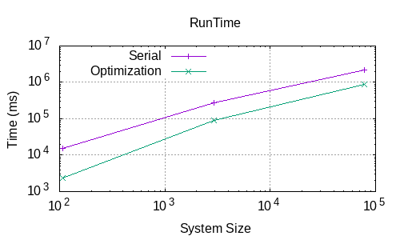
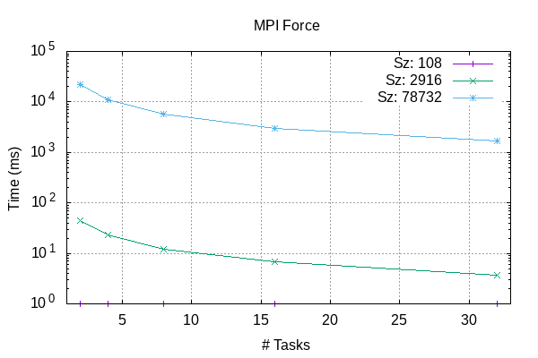
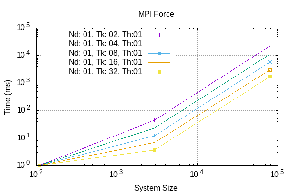
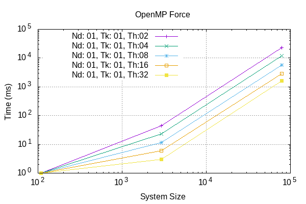
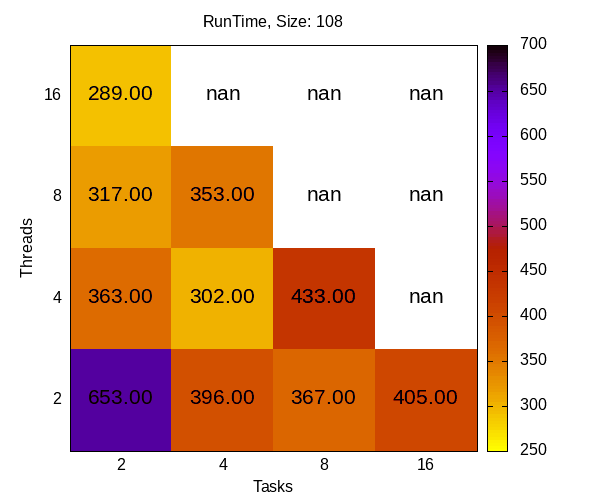

# LJMB
A simple Lennard-Jones Many-Body (LJMB) Simulator Optimization and Parallelization

- Andrea -> openmp
- Fathi  -> mpi
- Ken    -> optimization

## Running
Compile with cmake -S . -B build -D LJMD_MPI=ON -D LJMD_OPENMP=ON; for compiler optimization flags, add -DCMAKE_CXX_FLAGS="-O3 -Wall -ffast-math -fexpensive-optimizations -msse3".
From command line, while in LJMB/data folder:
1) export export OMP_NUM_THREADS=<n. threads>
2) mpirun --bind-to-socket -np <n. processing elements> ../build/MAIN.x < <chosen .inp file> 
Input .inp and .rest files, output .dat and .xyz files can be found in LJMB/data; simulation outputs can be compared with references in LJMB/data/refs folder. Input files contain the physical parameters to start the simulation for 108, 2916 and 78732 atoms of argon in liquid state.  

## Functions
Splitted functions source files are in LJMD/src:
- main.cpp: main function
- init.c: initialize -> reading input files and restart, memory allocation
- comp.c: ekin -> kinetic energy computation; force -> forces computation
- verlet.c: velverlet -> velocity propagation by half, position by a full step; velverlet_prop -> propagate velocities by another half step 
- utils.c: azzero -> array gets all elements zeroed; helper -> apply minimum image convention; get_a_line: reads a line from a file and cuts away blank spaces and comments
- output.c: output -> append data to output file
- cleanup.c: cleanup -> close files, free allocated memory.

## Headers and auxiliary files
Headers and auxiliary files are in LJMD/inc:
- structs.c: physical constants which are used during computation
- Timer.hpp: functions for measuring and printing time results
- myMPI.hpp: MPI variables
- init.h, comp.h, verlet.h, utils.h, output.h, cleanup.h: prototypes for the respective functions.
The headers and auxiliary files are built by the compiler into a mdlib library.

## Implemented tests
The implemented test framework for the separated functions is GoogleTest. The src files used for compiling are in LJMB/test. After compiling, the tests executables can be found in LJMB/build. All tests are executed on 2 particles:
- test_comp -> testing ekin, force functions
- test_utils -> testing azzero, pbc functions 
- test_verlet -> testing velverlet, velverlet_prop functions

## Benchmarks
We performed a series of benchmarks on the Leonardo HPC supercomputer hosted by CINECA, using the Booster partition with 32 cores per node. 
These benchmarks consider the timings and number of calls, depending on the simulation sizes (108, 2916, 78732 atoms) for the Force, Velverlet, Propagate, Kinetic Energy computation functions, as well as the total Run Time, under several configurations of number of processing elements (cores), number of threads, and number of nodes. 

### Serial vs. Optimized
Serial runs without optimizations are profiled using the gprof command:

		     Call graph (explanation follows)

granularity: each sample hit covers 2 byte(s) for 0.52% of 1.91 seconds

index % time    self  children    called     name
                                                 <spontaneous>
[1]     63.9    1.22    0.00                 force [1]
-----------------------------------------------
                                                 <spontaneous>
[2]     30.4    0.58    0.00                 pbc [2]
-----------------------------------------------
                                                 <spontaneous>
[3]      5.2    0.10    0.00                 azzero [3]
-----------------------------------------------

which clearly shows that the majority of spent execution time (63.9%) is due to the Force function. 

The Force timing and total RunTime of the serial version are here compared against runs with an Optimized version of the program. The latter uses "-O3 -Wall -ffast-math -fexpensive-optimizations -msse3" compiler flags and code optimizations, in particular the application of Newton's 3rd law for Forces computation (in comp.c function) and avoiding time expensive math functions like pow(), sqrt(), division. 
However, these optimizations determine a known floating point divergence between the simulation results and the reference datasets, which is especially evident using 108 atoms for the simulation.  

The optimizations, as expected, determine speedups in the execution of the Force computation time.

### MPI
Parallel runs by Message Passing Interface implementation with:
- Number of nodes: 1;
- Number of processing elements: 2, 4, 8, 16, 32;
- Number of threads: 1.
The MPI code parts are activated by *#ifdef MY_MPI [...] #endif*, set by -D LJMB_MPI=ON at compiling. Mpirank = 0 and number of processing elements are stored as default members of the *sys struct in case of -np = 1 or overwritten by each processor when np>1. MPI is mostly employed here to speed up the Force computation, by splitting it among different arrays of atoms managed by different processing units. This is generally made possible in Force function by: 
- broadcasting the position of atoms among processes
- creating indices employed by loop control flows dependent on the number of processes and their ranks,
- using dedicated buffers for the storage of computed forces 
- and finally reducing the forces computed by all processes and the total energy potential back into rank 0 process. This is done on top of the already implemented Optimized code.  

### OpenMP
Parallel runs with Open Multiprocessing implementation with:
- Number of nodes: 1;
- Number of processing elements: 1;
- Number of threads: 2, 4, 6, 8, 16, 32.
The OpenMP codelines, similarly to MPI, are enabled by *#ifdef (_OPENMP) [...] #endif* when -D LJMB_OPENMP=ON at compiling. Similarly to MPI, in the Force function OpenMP divides the force computation among different threads, actually following an MPI-like hybrid approach:
- creation of a parallel region, with reduction for the sum of all energy potentials;  
- each thread uses its own buffer pointers to hold full array of atoms, selected depending on the thread id, thus eliminating any race condition 
- after the computation of forces by each thread, an *omp barrier* is raised to synchronize the results of forces computed from all threads and reduce them in a parallel way, dependent on the number of threads. This is still done on top of the Optimized version of the Force function.
OpenMP *parallel for* is also applied to the loops inside the functions velverlet and velverlet_prop.  

### MPI+OpenMP
Parallel runs using both MPI and OpenMP with: 
- Number of nodes: 1;
- Number of processing elements: 2, 4, 6, 8, 16, 32;
- Number of threads: 2, 4, 6, 8, 16, 32.
Number of proc. elements*threads < 32 (maximum number of cores in a Leonardo node in Booster).
This hybrid approach is done in an "orthogonal" way, where the MPI and OpenMP cohexist by using buffers with increased sizes, indices depending on nPEs and number of threads, as well as on the processor rank and thread id, and making sure that the MPI calls are not done inside the OpenMP parallel region.  

In the case of the smallest system size (108), there is no real scaling in the Force computations timings normalized by their calls, since the timings are practically constant. This means that there would no speedup from increasing the number of npes or threads.

However, by increasing the system size (2916, 78732), we see that there is a reduction in timing so a definite speedup, though there is no clear best combination of nPEs and number of threads.  

